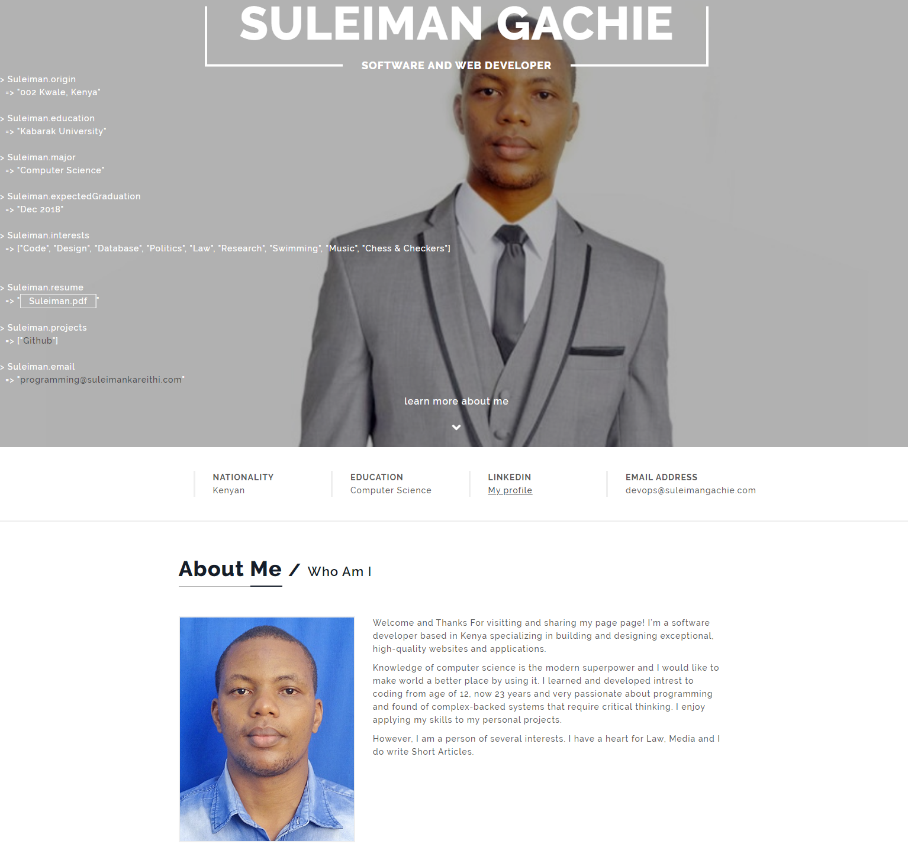

# <a href="https://suu-money.github.io/suleimangk" target="_blank">My Portfolio</a>

My portfolio showcases my projects, web presence, story, work experience, and contact information. Explore to see how I combine clean design with user-friendly interactions.

This is an improvement of my first project:

:star: Star me on GitHub — it helps!

# Sections 📚
✔️ Mini intro\
✔️ About me \
✔️ Skills \
✔️ Projects \
✔️ Chronology \
✔️ Contact me \

## Installation & Deployment 📦
- Clone the repository and modify the content according to your requirements.
- ⚠️ **NOTE:** Make sure to remove `analyticsId` & `google search console Id` from the `<head>` tag, and set yours if you want to use your own Google Analytics & Search Console account. ⚠️

## License 📄
This project is licensed under the MIT License - see the [LICENSE.md](./LICENSE) file for details.

## Tools Used 🛠️
* [**GitHub**](https://github.com/) - To host my static website (HTML, CSS, JS).
* [**Animista**](https://animista.net/) - For interactive animations.

Please contact me at [suleleimankareithi@yahoo.com](mailto:suleleimankareithi@yahoo.com) if you have any feedback for the website. :star: Star it if you like it!
